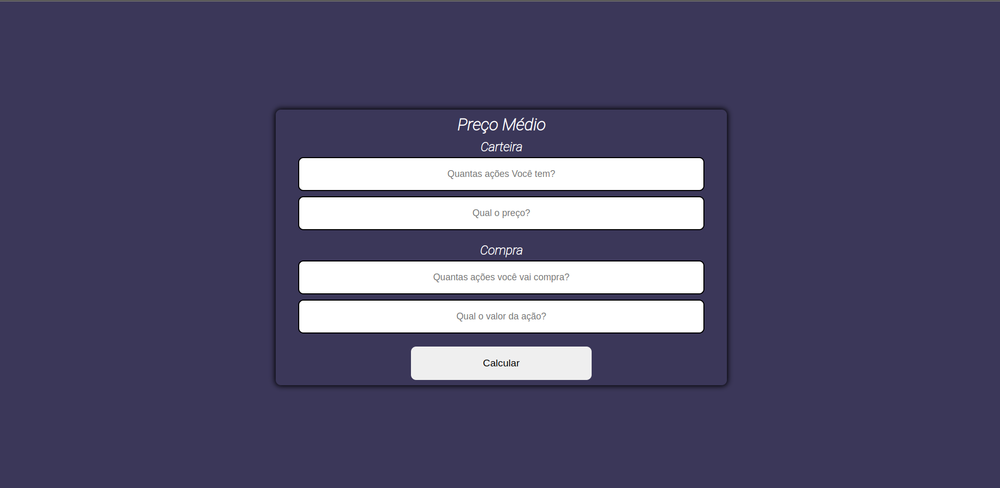
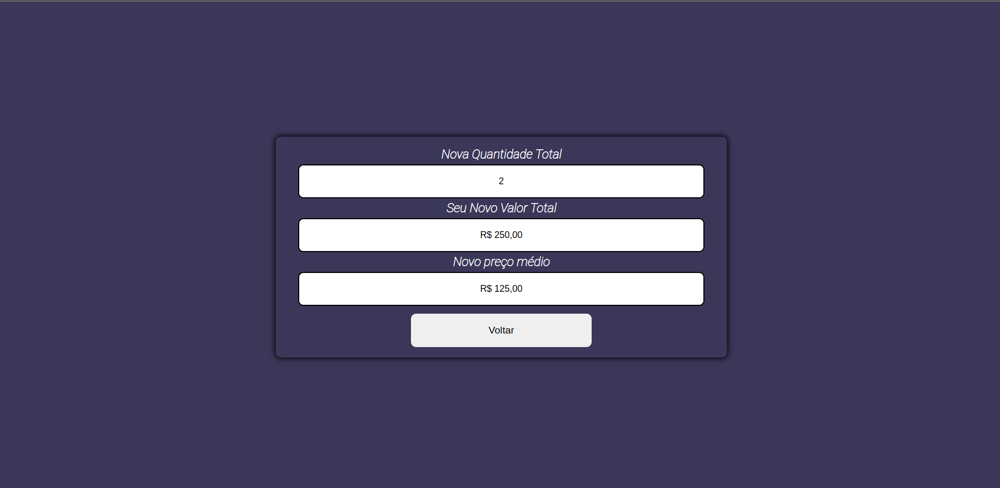

# fills-calculeitor

## A Principal ideia deste projeto é facilitar o calculo do preço médio para quem investe em fundos imobiliario

---

# Inicial

# Erro

# Inputs 

# Calculo

# qualquer sugestão de melhoria pode entrar em contato comigo atráves das redes sociais

## Linkedin https://www.linkedin.com/in/denner-bernardes/